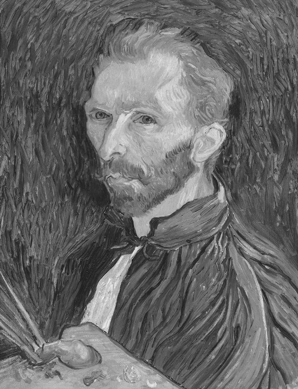
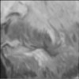
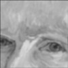
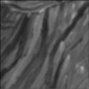
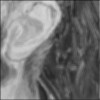
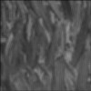
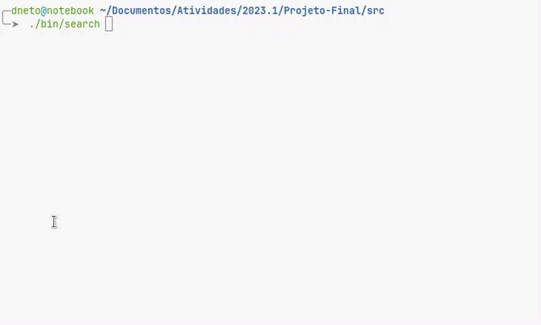

Tivemos como tarefa desenvolver um projeto que consiste na criação de dois algoritmos implementados em linguagem C. 

O primeiro algoritmo consiste no desenvolvimento de um programa que receba uma imagem qualquer no formato `.pgm` e faça cortes 100x100 aleatórios sobre essa imagem de origem. A seguir os cortes devem ser suavizados utilizando algum método de suavização de imagens, que no caso foi utilizado o filtro da média com uma área 3x3. Após isso os cortes devem ser salvos em arquivos `.pgm` além de um arquivo contendo suas posições originais do corte.

O segundo algoritmo está ligado ao primeiro, mas é totalmente independente. Basicamente precisamos desenvolver um programa que receba uma imagem de origem e um diretório que contenha cortes da mesma. O programa precisa encontrar a posição original de onde cada corte foi retirado da imagem. Para isso podemos utilizar algumas medidas de similaridade ou dissimilaridade, no caso foi utilizado o `RMSE`: raiz quadrada do erro quadrático médio.

Este projeto além do objetivo acadêmico também nos trouxe uma boa introdução em algumas etapas no processamento de imagens.

<br>


###### Os principais objetivos deste projeto são:

- Desenvolver algoritmos eficientes e coerentes em linguagem C para o processamento dessas imagens.

- Realizar cortes de 100x100 pixels na imagem de origem e suavizá-los utilizando o filtro da média em uma área 3x3.

- Salvar a posição e todos os cortes em um diretório.

- Identificar a posição original dos cortes sem a necessidade de dados externos, utilizando o `RMSE` no caso.

- Desenvolver o método mais rápido e eficiente na busca.

</br>


Antes de utilizar os algoritmos, é necessário garantir os seguintes pré-requisitos:


- Compilador C instalado no sistema. Por exemplo o <a target="_blank" href="https://gcc.gnu.org/">GCC</a>
- Todas as imagens devem ser do formato `.pgm` do tipo `P2` ou `P5` para serem processadas.

</br>


</br>

Para utilizar os algoritmos, siga as seguintes etapas:</br></br>

1. Clone o repositório

```bash
git clone https://github.com/ana-le-ticia/Projeto_Final_Lab_Prog.git
```

2. Compile o projeto usando o comando

```bash
make
```

3. Os arquivos binários dos programas são gerados no diretório `bin/` do repositório clonado.

4. Para realizar cortes em uma imagem, utilize:

```bash
./bin/crop 'caminho da imagem' <tamanho dos cortes> <quant. de cortes>
```

5. Para realizar a busca:

```bash
./bin/search 'imagem de origem'
```

</br>


</br>


###### Busca de imagens:

> As imagens a seguir estão no formato .jpg para permitir a ilustração.

<div align="center">
    <figure align="center">
        
        
        
        
        
        
        
    </figure>
    <figure>
        
    </figure>
</div>

No exemplo acima, o programa percorre todos os arquivos `.pgm` do diretório onde os cortes foram salvos e compara com cada posição da imagem passada por argumento. Como resposta é mostrado a posição e a menor raiz do erro quadrático médio encontrada: `(x, y) = RMSE`.

</br>


Gostaríamos de agradecer a todos os membros da equipe que contribuíram para o desenvolvimento deste projeto. Cada um desempenhou um papel importante que resultou em uma solução robusta e eficiente. A equipe inclui:

<table align="center">
    <tbody align="center">
        <tr align="center">
            <td align="center">
                <a href="" target="_blank">
                     
                </a>
            </td>
            <td align="center">
                <a href="" target="_blank">
                     
                </a>
            </td>
            <td align="center">
                <a href="https://github.com/DarksaurGames" target="_blank">
                     
                </a>
            </td>
            <td align="center">
                <a href="https://github.com/d-neto" target="_blank">
                     
                </a>
            </td>
        </tr>
        <tr align="center">
            <td align="center">
                <a href="" target="_blank">
                    Herbert
                </a>
            </td>
            <td align="center">
                <a href="" target="_blank">
                    Letícia
                </a>
            </td>
            <td align="center">
                <a href="https://github.com/DarksaurGames" target="_blank">
                    Mateus
                </a>
            </td>
            <td align="center">
                <a href="https://github.com/d-neto" target="_blank">
                    Neto
                </a>
            </td>
        </tr>
    </tbody>
</table>
